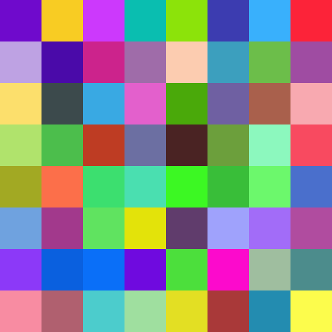

# Random Quilt Generator

Example

```
require_once( 'class.random-quilts.php' );

$quilt = new Random_Quilts( 'cat' );
$quilt->set_grid_size( 8 );
$quilt->set_block_size( 60 );
$quilt->build_image();
```

